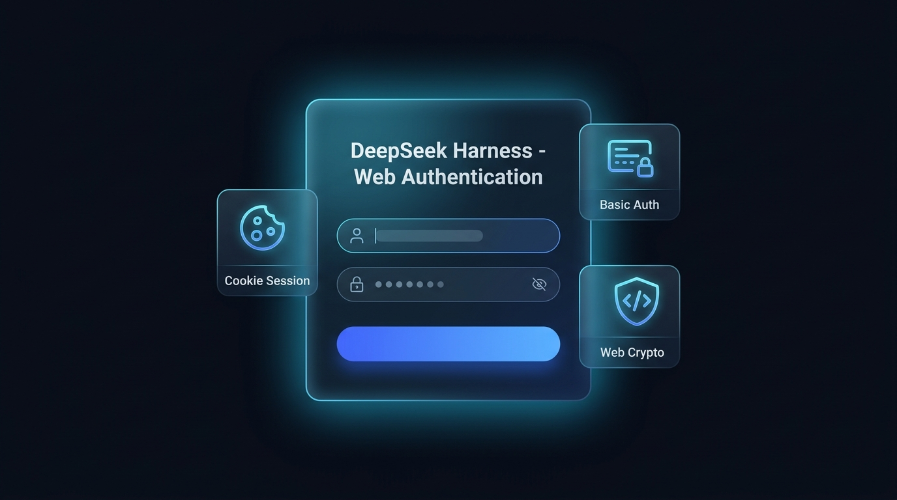

<p align="center">
  
</p>

<div align="center">

# dsh-plugin-auth-webserver

[](LICENSE)
[](https://github.com/kolawong/dsh-plugin-auth-webserver/stargazers)
[](https://github.com/deepseek-ai/deepseek-harness)

**DeepSeek Harness (DSH) 原生 Web 安全认证与登录插件。**
为云服务器部署、局域网共享和多设备远程访问提供原生外观的 **Web 登录界面**、**Cookie 会话保持**、**Basic Auth 兼容**、**Web GUI 可视化设置** 以及 **Web Crypto Polyfill**。

[English](README.md) | 🌐 **简体中文**

</div>

---

## ✨ 核心特性

- **🎨 深度匹配 DSH 原生美学的 Web 登录界面**：
  - 彻底告别浏览器简陋的弹窗，提供暗黑毛玻璃质感、微光边框、DeepSeek 风格专属定制的网页登录页面。
  - 支持密码显示/隐藏切换、错误抖动动画、一键回车提交，完美适配移动端与桌面端。
- **🍪 安全长效的 Cookie / Session 会话机制**：
  - 登录成功后自动生成 30 天加密 HMAC 会话 Token，无需每次刷新重复输入账号密码。
  - 提供 `/api/auth.logout` 一键退出接口与前端退出按钮。
- **⚙️ Web GUI 可视化设置卡片**：
  - 在 DSH 网页端 **「设置」->「插件（Plugins）」-> 🔒 Web 访问密码认证** 中直接查看与修改账号密码。
  - 内存实时热更新并自动回写持久化配置文件，无需重启服务。
- **🔌 双模鉴权与 WebSocket 实时保护**：
  - 网页端优先采用 Web 表单与 Cookie 会话；同时向下兼容 `HTTP Basic Auth`，方便命令行脚本、`curl` 与自动化工具调用。
  - 完整覆盖 HTTP 路由与 WebSocket (`upgrade`) 协议通道。
- **🛡️ 远端 IP 特权 RPC 网关信任委托**：
  - 自动处理请求 `Host` / `Origin` 映射，彻底解决公网 IP 访问时 `settings.describe` 与 `agentPreset.*` 报 `HTTP 403 Forbidden` 的问题。
- **🔑 Web Crypto UUID 自动 Polyfill**：
  - 自动在页面 `<head>` 中注入安全的 UUID 生成器，彻底解决非 HTTPS 或直接通过 IP 访问时客户端报错崩溃的问题。

---

## 📦 安装与配置

### 第一步：克隆插件到 DSH 插件目录

```bash
mkdir -p ~/.dsh/plugins/dsh-plugin-auth-webserver
cd ~/.dsh/plugins/dsh-plugin-auth-webserver
git clone https://github.com/kolawong/dsh-plugin-auth-webserver.git .
```

### 第二步：配置 Web Profile 补丁

编辑 `~/.dsh/profiles/web/cordis.patch.yml`：

```yaml
- id: webserver
  disabled: true

- insert:
    - id: webserver-auth
      name: '@custom/dsh-plugin-auth-webserver'
      inject:
        - webStartup
      config:
        host: '0.0.0.0'
        port: !!js ctx.webStartup.port ?? 3080
        username: 'admin'
        password: 'your_secure_password'
```

### 第三步：重启 DSH 服务

```bash
# 如果使用 systemd 管理：
systemctl restart deepseek-harness

# 或直接通过命令行启动：
dsh web --port 3080
```

打开浏览器访问 `http://你的服务器IP:3080`，即可看到全新的 DSH 原生风格登录页面！

---

## 🔧 配置项说明

| 配置项 | 类型 | 默认值 | 说明 |
|---|---|---|---|
| `host` | `string` | `'0.0.0.0'` | 监听的网络接口地址 (`0.0.0.0` 或 `127.0.0.1`)。 |
| `port` | `number` | `3080` | Web 服务监听端口。 |
| `username` | `string` | `'admin'` | 登录用户名。 |
| `password` | `string` | `''` | 登录密码（留空则不开启验证）。 |
| `realm` | `string` | `'DeepSeek Harness Authentication'` | Basic Auth 认证领域标识。 |

---

## 📡 API 接口

- `POST /api/auth.login` — 用户名密码登录并获取 Session Cookie (`{ username, password }`)。
- `POST /api/auth.logout` — 退出登录并清除 Cookie。
- `GET /api/auth.get` — 获取当前用户名与 realm 信息。
- `POST /api/auth.update` — 实时修改用户名与密码并持久化保存。

---

## 📄 开源协议

本项目采用 [MIT 许可证](LICENSE) © 2026 kola
